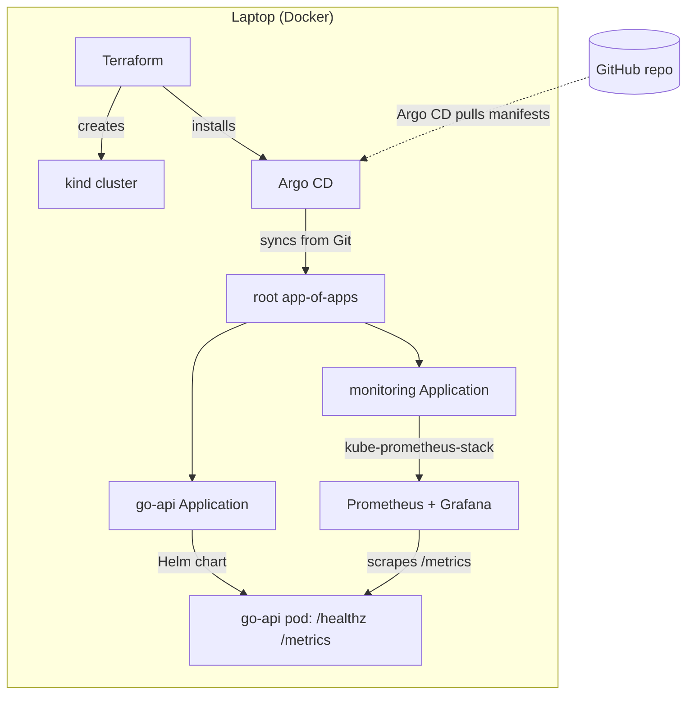

# gitops-platform-lab

A local, zero-cost **GitOps Kubernetes platform** — provisioned with Terraform, run by Argo CD, observed with Prometheus & Grafana. Spins up in Docker on a laptop with one command.


## What it demonstrates

- **Infrastructure as Code** — the Kubernetes cluster is defined in Terraform (`tehcyx/kind`), not clicked together.
- **GitOps** — Terraform bootstraps Argo CD; Argo CD then deploys everything else from this repo (app-of-apps). Git is the source of truth and the cluster continuously reconciles to match it.
- **Container craft** — a Go service built via a multi-stage Dockerfile into a ~16 MB distroless, non-root image.
- **Observability** — Prometheus scrapes the app's custom `/metrics`; Grafana visualizes them.
- **CI** — GitHub Actions validates Terraform, Helm, rendered manifests (kubeconform), Go, and security (Trivy) on every push.

## Architecture



**Core idea:** *Terraform bootstraps the cluster + Argo CD; Argo CD runs everything else from Git.*

## Quickstart

**Prerequisites:** Docker, and the CLIs `terraform`, `kubectl`, `helm`, `kind`, `go`.

```bash
make up             # build image, create cluster + Argo CD, bootstrap GitOps
make argo-password  # print the Argo CD admin password
make down           # tear it all down
```

`make up` is idempotent — safe to re-run. Everything runs locally; there is **no cloud cost**.

## Accessing the UIs

```bash
kubectl -n argocd     port-forward svc/argocd-server 8081:443      # Argo CD → https://localhost:8081 (user: admin)
kubectl -n monitoring port-forward svc/monitoring-grafana 3000:80  # Grafana → http://localhost:3000 (admin/admin)
```

In Grafana, open **Explore** and query `app_http_requests_total` to see the app's live metric.

## Repo layout

```
terraform/   Bootstrap layer: kind cluster + Argo CD (the only imperatively-applied part)
gitops/      Argo CD app-of-apps: root-app.yaml + child Applications (go-api, monitoring)
charts/      Helm chart for the go-api service (Deployment, Service, ServiceMonitor)
app/         Go service + multi-stage Dockerfile
.github/     CI workflow (fmt/validate, helm lint, kubeconform, go, trivy)
```
